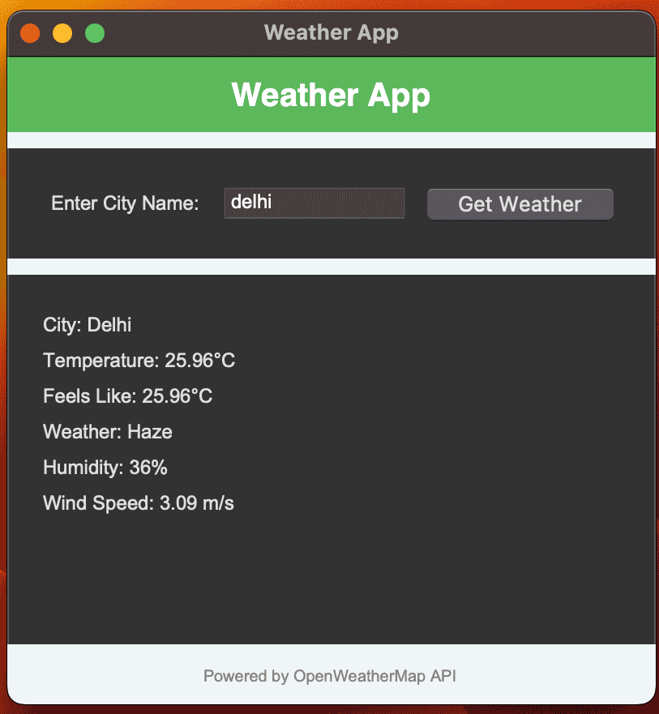
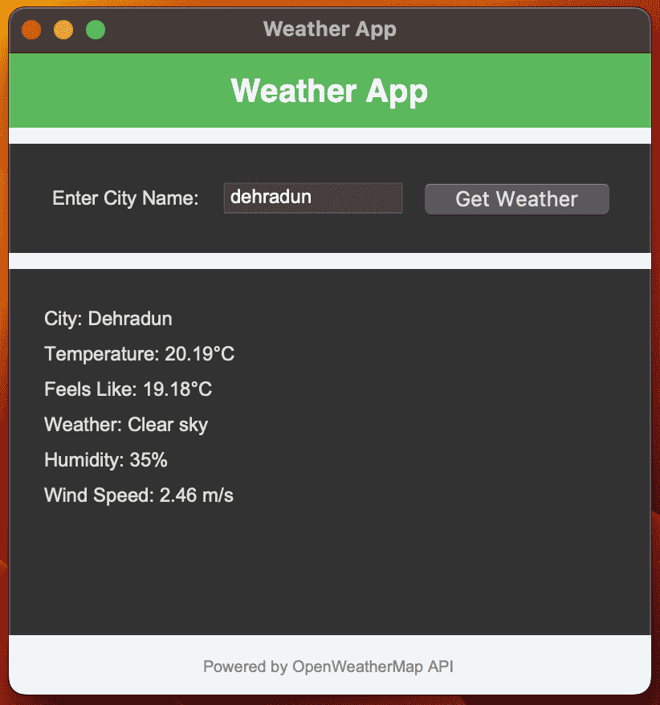
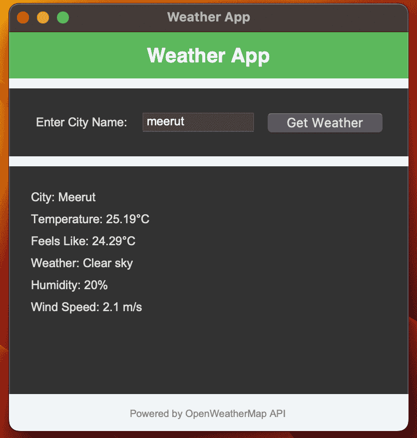
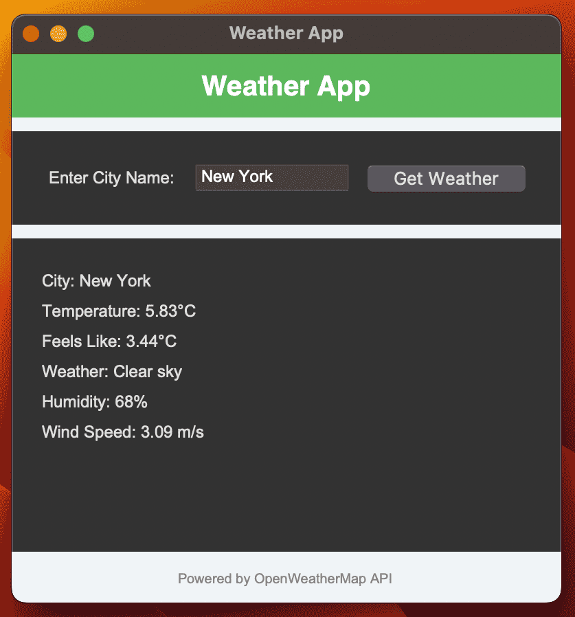

# Weather App

This is a simple Weather App that allows users to check the current weather for any city using the OpenWeatherMap API. The app displays key weather details such as temperature, humidity, wind speed, and weather conditions.

## Features:
- Input a city name to get the weather information.
- Displays the temperature, feels like, humidity, weather description, and wind speed.
- Built using Python's `tkinter` for the GUI and the `requests` library to fetch data from the OpenWeatherMap API.
- Press **Enter** to automatically fetch weather after typing the city name.

## Requirements:
- Python 3.x
- `tkinter` (usually comes pre-installed with Python)
- `requests` (Install using `pip install requests`)

## How to Use:
1. Run the `weather_app.py` file.
2. Enter a city name in the input box.
3. Press the **Enter** key or click on **Get Weather** to fetch the weather details.

## Screenshots
Here are the screenshots of the Simple GUI Calculator:

### Screenshot 1:

### Screenshot 2:

### Screenshot 3:

### Screenshot 4:

